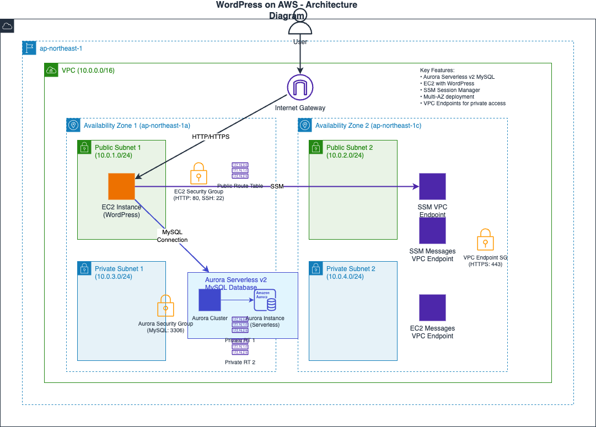
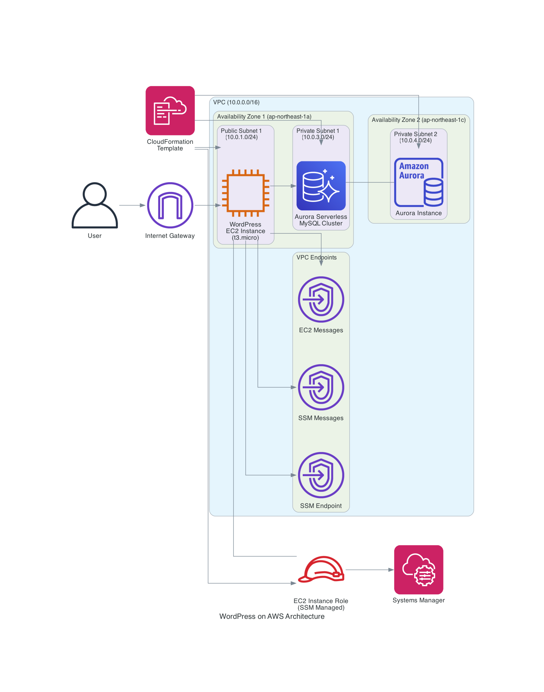
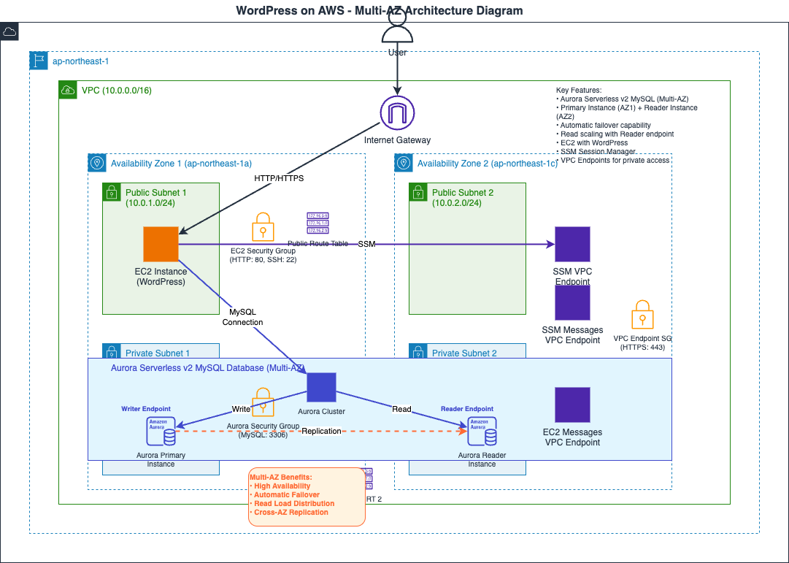
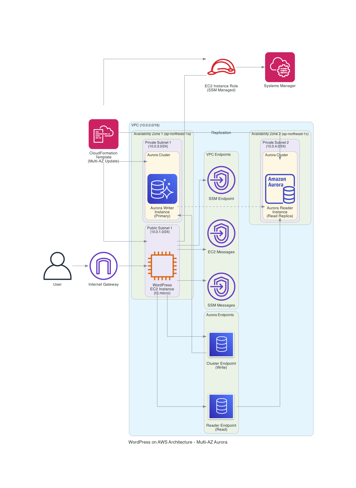
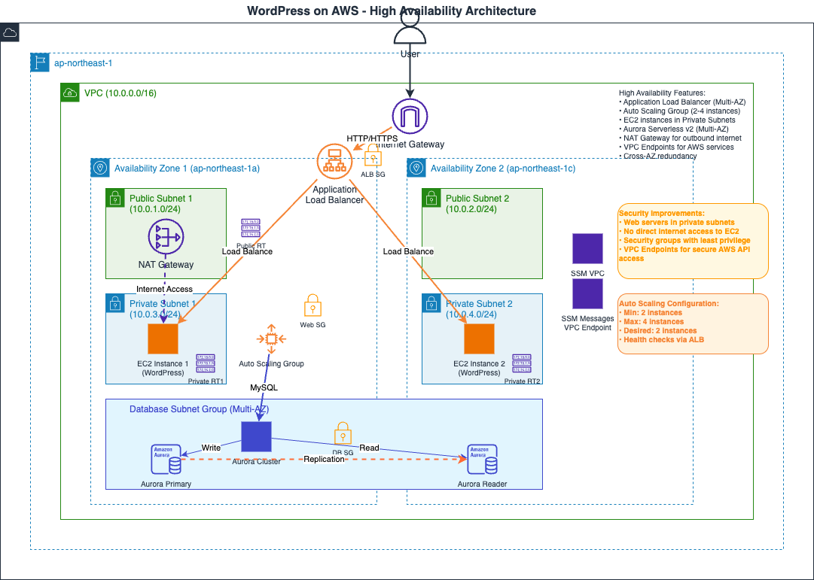
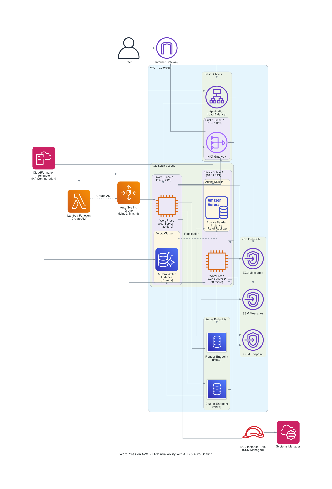

# AWS Fault Injection Service (FIS) ハンズオン

JAWS-UG 神戸 #7 で実施予定の AWS Fault Injection Service ハンズオン用リポジトリです。

## 概要

AWS FIS を使用して障害注入実験を体験し、システムの耐障害性を検証するハンズオンです。
段階的にインフラを拡張しながら、様々な障害シナリオを実行していきます。

## ファイル構成

### CloudFormation テンプレート

`init.yaml` - 基本的なVPC、EC2インスタンス、Aurora Serverlessを構築

この CloudFormation テンプレートで作成されるリソースを図にしています（ここも生成AI）

### Amazon Q Developer for CLI で以下のプロンプトで生成したもの

> init.yaml で作成する WordPress サイトがあります。これを draw.io として読み込み編集することのできる XML ファイルをアウトプットとした構成図として作成したい

### Amazon Q Developer for CLI + AWS Diagram MCP Server で以下のプロンプトで生成したもの

> init.yaml で作成する WordPress サイトがあります。これを構成図として作成したい

`changeset.yaml` - Multi-AZ構成への拡張

この CloudFormation テンプレートで作成されるリソースを図にしています（ここも生成AI）

### Amazon Q Developer for CLI で以下のプロンプトで生成したもの

> 2枚目の構成図を作成したいです。changeset.yaml の内容が init.yaml の変更セットとして変更したものです。Aurora Cluster 内の DB インスタンスをマルチAZ構成にしたものとなります。

### Amazon Q Developer for CLI + AWS Diagram MCP Server で以下のプロンプトで生成したもの

> 2枚目の構成図を作成したいです。changeset.yaml の内容が init.yaml の変更セットとして変更したものです。Aurora Cluster 内の DB インスタンスをマルチAZ構成にしたものとなります。

`changeset-02.yaml` - 高可用性構成への最終拡張

この CloudFormation テンプレートで作成されるリソースを図にしています（ここも生成AI）

### Amazon Q Developer for CLI で以下のプロンプトで生成したもの

> 3枚目の構成図も作成したいです。changeset-02.yaml の内容になりますが、これは init.yaml → changeset.yaml で実施した変更セットをさらに拡張するための変更セットテンプレートになります。フロントエンドのウェブサーバの耐障害性を高めるために、ALB 配下のロードバランサー配下で動作するマルチAZ構成に変更しています。さらにベストプラクティスに沿ってウェブサーバもプライベートサブネットへの配置としています。

### Amazon Q Developer for CLI + AWS Diagram MCP Server で以下のプロンプトで生成したもの

> 3枚目の構成図も作成したいです。changeset-02.yaml の内容になりますが、これは init.yaml → changeset.yaml で実施した変更セットをさらに拡張するための変更セットテンプレートになります。フロントエンドのウェブサーバの耐障害性を高めるために、ALB 配下のロードバランサー配下で動作するマルチAZ構成に変更しています。さらにベストプラクティスに沿ってウェブサーバもプライベートサブネットへの配置としています。

### ハンズオンシナリオ
- `handson/scenario-01.md` - 事前準備とインフラ構築
- `handson/scenario-02.md` - AWS FIS の設定と実験1（CLI操作）
- `handson/scenario-03.md` - AWS FIS の設定と実験2（シナリオライブラリ活用）
- `handson/scenario-04.md` - 後片付け

## 実行手順

1. **事前準備** - `init.yaml` でベースインフラを構築
2. **基本実験** - scenario-01, scenario-02 で AWS FIS の基本操作を学習
3. **拡張実験** - `changeset.yaml` でインフラを拡張し、scenario-03 を実行
4. **高度な実験** - `changeset-02.yaml` で最終構成にし、より複雑な障害シナリオを実行
5. **後片付け** - scenario-04 でリソースを削除

## 前提条件

- 新規 AWS アカウントの使用を推奨
- 東京リージョン（ap-northeast-1）での実行
- AWS CLI は CloudShell での操作を想定
- 各段階で約15分程度の構築時間が必要

## 注意事項

- 2025年6月15日時点のAWS API仕様に基づいて作成
- 従量課金が発生するため、ハンズオン終了後は必ずリソースを削除してください

## 免責

本 README ファイルも Amazon Q Developer for CLI を用いて生成したものとなります。  
利用したプロンプトは以下の通りです。

> カレントディレクトリにあるファイル群を用いて Amazon FIS(Fault Injection Service)のハンズオンを実施します。環境は 1. init.yaml 2. changeset.yaml 3. changeset-02.yaml の順に拡張していきます。それに応じて handson/ ディレクトリにあるシナリオを実行していく流れとなっています。この内容を簡潔に README.md に表せますか？