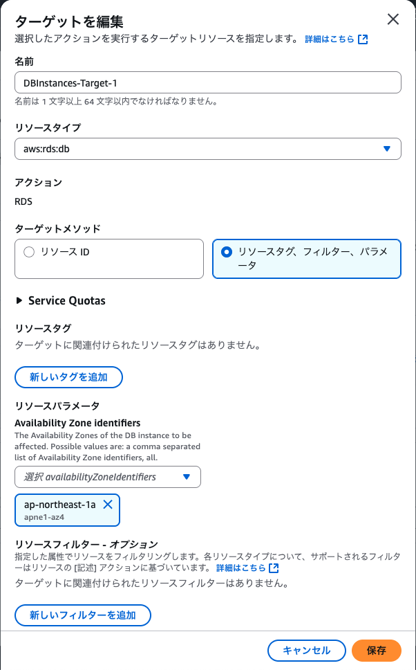
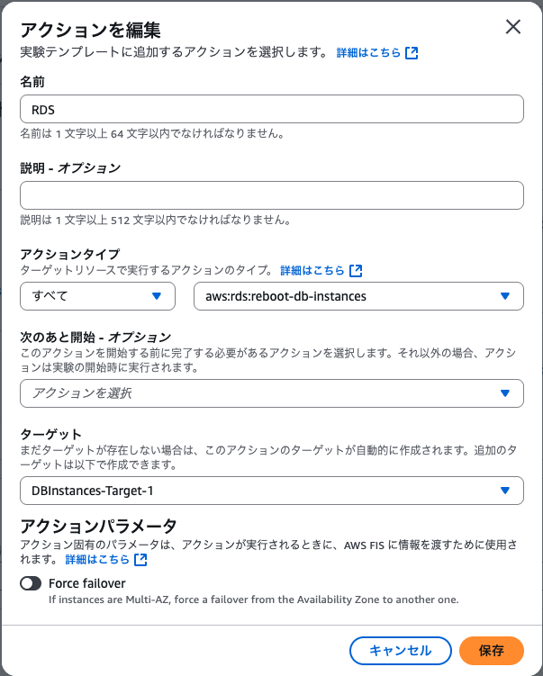
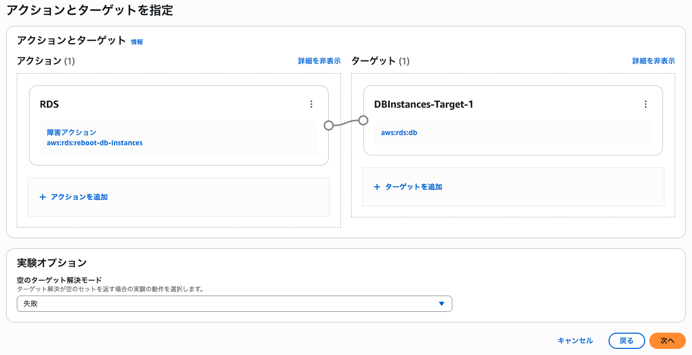
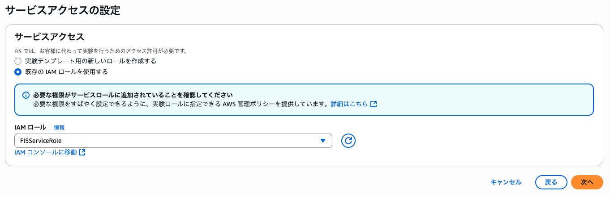

# 障害は忘れた頃にやってくる「AWS Fault Injection Service」で障害を食らってみよう / AWS FIS の設定と実験 1

JAWS-UG 神戸 #7 で実施予定の AWS Fault Injection Service ハンズオン用シナリオです。

## AWS FIS の設定

以降の操作は CloudShell で実行することを想定しています。

### AWS FIS 用の信頼関係ドキュメントの作成

信頼するエンティティとして AWS FIS（fis.amazonaws.com）を持つ信頼関係ドキュメントを作成します。

```bash
cat << EOF > fis-trust-policy.json
{
  "Version": "2012-10-17",
  "Statement": [
    {
      "Effect": "Allow",
      "Principal": {
        "Service": "fis.amazonaws.com"
      },
      "Action": "sts:AssumeRole"
    }
  ]
}
EOF
```

### AWS FIS 用の IAM ロールの作成とポリシーのアタッチ

後述する実験ドキュメントで指定し、実験のためのリソース操作を行う IAM ロールを作成します。

そして実験として EC2 に対する操作、RDS に対する操作を行いたいため、AWS で用意している `AWSFaultInjectionSimulatorEC2Access` ポリシーと `AWSFaultInjectionSimulatorRDSAccess` ポリシーをアタッチします。

```bash
aws iam create-role \
  --role-name FISServiceRole \
  --assume-role-policy-document file://fis-trust-policy.json

aws iam attach-role-policy \
  --role-name FISServiceRole \
  --policy-arn arn:aws:iam::aws:policy/service-role/AWSFaultInjectionSimulatorEC2Access

aws iam attach-role-policy \
  --role-name FISServiceRole \
  --policy-arn arn:aws:iam::aws:policy/service-role/AWSFaultInjectionSimulatorRDSAccess
```

### 実験テンプレートの作成1（RDSに対する操作の実験）

AWS マネジメントコンソールで CloudShell を起動し、以下のコマンドを実行します。

このテンプレートでは、現在稼働している DB インスタンスのアベイラビリティゾーンと同一の AZ 内のリソース全てを対象とした DB インスタンスの再起動を実行します。  

> [!WARNING]  
> コマンド自体は「事前準備1」の CloudFormation テンプレートをそのまま利用されていることを想定し、DB 識別子が「aurora-serverless-cluster-instance」であることを前提として組み立てています。  
> DB 識別子名を変更している場合は適宜読み替えてください。

```bash
DB_INSTANCE_AZ=$(aws rds describe-db-instances --query "DBInstances[?DBInstanceIdentifier=='aurora-serverless-cluster-instance'].AvailabilityZone" --output text)
ROLE_ARN_FOR_FIS=$(aws iam get-role --role-name FISServiceRole --query 'Role.Arn' --output text)
AWS_ACCOUNT_ID=$(aws sts get-caller-identity --query 'Account' --output text)
cat << EOF > fis-experiment-template-for-rds.json
{
    "description": "Reboot RDS",
    "targets": {
        "DBInstances-Target-1": {
            "resourceType": "aws:rds:db",
            "selectionMode": "ALL",
            "parameters": {
                "availabilityZoneIdentifiers": "${DB_INSTANCE_AZ}"
            }
        }
    },
    "actions": {
        "RDS": {
            "actionId": "aws:rds:reboot-db-instances",
            "parameters": {
                "forceFailover": "false"
            },
            "targets": {
                "DBInstances": "DBInstances-Target-1"
            }
        }
    },
    "stopConditions": [
        {
            "source": "none"
        }
    ],
    "roleArn": "arn:aws:iam::${AWS_ACCOUNT_ID}:role/FISServiceRole",
    "tags": {},
    "experimentOptions": {
        "accountTargeting": "single-account",
        "emptyTargetResolutionMode": "fail"
    }
}
EOF

aws fis create-experiment-template \
    --cli-input-json file://fis-experiment-template-for-rds.json
```

#### 補足

<details><summary>マネジメントコンソールで実施する場合は以下となります。</summary>

1. AWS マネジメントコンソールで  [AWS FIS](https://ap-northeast-1.console.aws.amazon.com/fis/home?region=ap-northeast-1#Home) → [実験テンプレート](https://ap-northeast-1.console.aws.amazon.com/fis/home?region=ap-northeast-1#ExperimentTemplates) ページへ遷移します
2. ページ右上にある「実験テンプレートを作成」ボタンをクリックします
3. 遷移した先の「テンプレートの詳細を指定」ページを以下の要領で入力します
    - 説明：「Reboot RDS」とします
    - 名前 - オプション：入力なしで可です
    - 実験タイプ：「アカウントターゲティング」は「この AWS アカウント:〜」のままとします
4. 画面右側のターゲットから「ターゲットを追加」をクリックし、以下の要領で入力し「次へ」ボタンをクリックします  
    - 名前：`DBInstances-Target-1`
    - リソースタイプ：`aws:rds:db`
    - ターゲットメソッド：`リソースタグ、フィルター、パラメータ`
    - リソースパラメータ：「Availability Zone identifiers」として `ap-northeast-1a` を選択する
    - リソースフィルター：「選択モード」を `すべて` とする
5. 画面左側のアクションから「アクションを追加」をクリックし、以下の要領で入力し「次へ」ボタンをクリックします  
   - 名前：`RDS`
   - アクションタイプ：プルダウンは「すべて」のまま `aws:rds:reboot-db-instances` とします
   - ターゲット：＜4＞ で作成した `DBInstances-Target-1` を選択
6. 「アクションとターゲット」画面で、手順4、手順5で作成したアクションとターゲットがつながっていることを確認し「次へ」ボタンをクリックします  
7. 遷移した先の「サービスアクセスの設定」ページででサービスアクセスとして「既存の IAM ロールを使用する」を選択し、IAM ロールに `FISServiceRole` を選択して「次へ」ボタンをクリックします  
8. 遷移した先の「オプション設定を行う」ページではデフォルトのまま「次へ」ボタンをクリックします
9. 遷移した先の「確認して作成」ページで内容を確認し、ページ最下部の「実験テンプレートを作成」ボタンをクリックします

</details>

## 実験の実施（1回目）

### 実験の操作

1. AWS マネジメントコンソールで  [AWS FIS](https://ap-northeast-1.console.aws.amazon.com/fis/home?region=ap-northeast-1#Home) → [実験テンプレート](https://ap-northeast-1.console.aws.amazon.com/fis/home?region=ap-northeast-1#ExperimentTemplates) ページへ遷移します
2. 「Reboot RDS」として作成されているテンプレートにチェックを入れ「実験を開始」ボタンをクリックします
3. 「実験を開始EXTxxxxxxxx」のページへ遷移したら「実験を開始」ボタンをクリックします

> [!TIP]
> 実行する実験に「タグ」をつけることも可能です

### 挙動の確認（想定）

- WordPress サイト側が「データベース接続エラー」とななる
- AWS マネジメントコンソール「Aurora and RDS」ページのデータベース一覧で DB 識別子「aurora-serverless-cluster-instance」が再起動中となる

## 実験の実施（2回目）

### 構成の変更

#### AWS 側の変更

CloudFormation スタックの変更セットを作成し、DB をマルチ AZ 化します。

```bash
wget https://raw.githubusercontent.com/kazzpapa3/jawsug-kobe/refs/heads/main/aws-fis/changeset.yaml
aws cloudformation create-change-set --change-set-name multi-az-db-instance --stack-name init --template-body file://changeset.yaml --capabilities CAPABILITY_IAM
CHANGESET_ARN_FOR_MULTI_AZ_DB_INSTANCE=$(aws cloudformation list-change-sets --stack-name init --query "Summaries[?contains(ChangeSetName,'multi-az-db-instance')].ChangeSetId" --output text)
aws cloudformation wait change-set-create-complete --change-set-name ${CHANGESET_ARN_FOR_MULTI_AZ_DB_INSTANCE}
aws cloudformation execute-change-set --change-set-name ${CHANGESET_ARN_FOR_MULTI_AZ_DB_INSTANCE}
```

<details><summary>マネジメントコンソールで実施する場合は以下となります。</summary>

1. [changeset.yaml](https://raw.githubusercontent.com/kazzpapa3/jawsug-kobe/refs/heads/main/aws-fis/changeset.yaml) をダウンロードします
2. CloudFormation スタックを選択し「スタックの更新」プルダウンから「変更セットを作成」をクリックします
3. 「前提条件 - テンプレートの準備」を「既存のテンプレートを置換」とし、「テンプレートの指定」を「テンプレートファイルのアップロード」とした上で ＜1＞ でダウンロードした CloudFormation テンプレートをアップロードし、「次へ」ボタンをクリックします
4. 遷移した「変更セットの詳細を指定」ページは変更せず、ページ下部の「次へ」ボタンをクリックします
5. 「変更セットオプションを設定 - オプション」ページ下部の「AWS CloudFormation によって IAM リソースが作成される場合があることを承認します。」にチェックを入れ「次へ」をクリックし、次画面で「送信」ボタンをクリックします
6. 「変更セット」の詳細画面に遷移したのち、「変更セットを実行」ボタンが活性化するまでを待機します。（待機時間は約 2 分）
7. そのまま「変更セットを実行」ボタンをクリックし、表示されるダイアログも変更せずそのまま「変更セットを実行」ボタンをクリックします（このあと 15 分ほど時間を要します）
8. スタックのステータスが「UPDATE_COMPLETE」となったことを確認し、「出力」タブから `AuroraClusterReaderEndpoint` の値を控えておきます

</details>

#### WordPress 側の変更

WordPress の LudicrousDB プラグインを活用し、CRUD の性質によってアクセス先の DB エンドポイントの変更をします。
CloudShell で以下のように実行します。

##### Webサーバへの接続まで

```bash
KEY_NAME=$(aws ssm describe-parameters --query "Parameters[?contains(Name, 'keypair')].Name" --output text)
aws ssm get-parameters --names "${KEY_NAME}" --with-decryption --query "Parameters[].Value" --output text > key.pem
chmod 400 key.pem
PUBLIC_IP=$(aws ec2 describe-instances   --filters "Name=instance-state-name,Values=running"   --query 'Reservations[].Instances[?contains(Tags[?Key==`Name`].Value | [0], `-EC2-Instance`)][].NetworkInterfaces[].Association.PublicIp' --output text)
ssh -i key.pem ec2-user@"${PUBLIC_IP}"
```

##### Webサーバへの接続後、インスタンス内部での操作

```bash
cd /var/www/html/
wp plugin install https://github.com/stuttter/ludicrousdb/archive/refs/heads/master.zip
cp wp-content/plugins/ludicrousdb/ludicrousdb/drop-ins/db.php wp-content/
cp wp-content/plugins/ludicrousdb/ludicrousdb/drop-ins/db-error.php wp-content/
cp wp-content/plugins/ludicrousdb/ludicrousdb/drop-ins/db-config.php .
```

db-config.php の 108行目付近を以下のように書き換えます。

```
vi db-config.php
# 108行目付近を以下のように書き換える
-                 'host'     => DB_HOST,     // If port is other than 3306, use host:port.
+                 'host' => '{前工程で控えた AuroraClusterReaderEndpoint の値}',
```

##### WordPress 側でのプラグインの有効化

1. WordPress の管理画面へアクセスする。（この手順に沿っていれば http://${CloudFormation の出力タブの EC2PublicIP の値}/wp-admin/ のはず）
2. 左サイドナビから「プラグイン」リンクをクリックする
3. 一覧表示の中の「LudicrousDB」の「有効化」リンクをクリックする

### 実験の操作

1. AWS マネジメントコンソールで  [AWS FIS](https://ap-northeast-1.console.aws.amazon.com/fis/home?region=ap-northeast-1#Home) → [実験テンプレート](https://ap-northeast-1.console.aws.amazon.com/fis/home?region=ap-northeast-1#ExperimentTemplates) ページへ遷移します
2. 「Reboot RDS」として作成されているテンプレートにチェックを入れ「実験を開始」ボタンをクリックします
3. 「実験を開始EXTxxxxxxxx」のページへ遷移したら「実験を開始」ボタンをクリックします

### 挙動の確認（想定）

- AWS マネジメントコンソール「Aurora and RDS」ページのデータベース一覧で DB 識別子「aurora-serverless-cluster-instance」が再起動中となるものの、WordPress サイト側が「データベース接続エラー」とならず影響を受けない

> [!Note]
> 余裕があれば、該当のデータベースを選択し「アクション」プルダウンより「フェイルオーバー」を選択して、フェイルオーバーを発生させリーダーとライターのインスタンスの AZ を入れ替えてみてください。  
> その上で、再度実験をしても Web サイトの読み取りアクセスにはエラーが起きないはずです。

---

[AWS FIS の設定と実験 2](./scenario-03.md) へ

