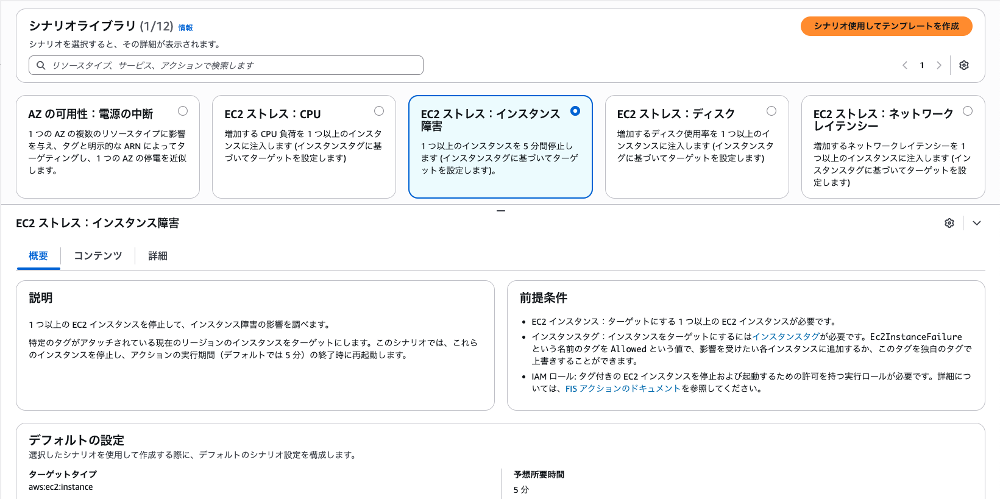
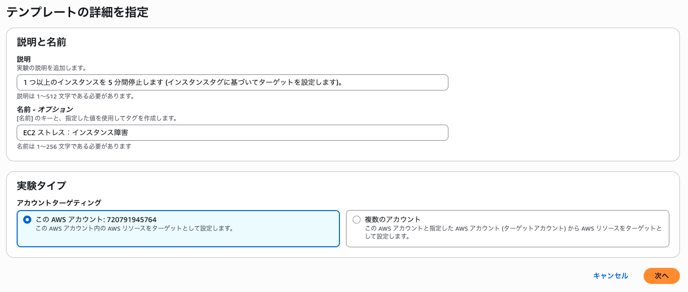
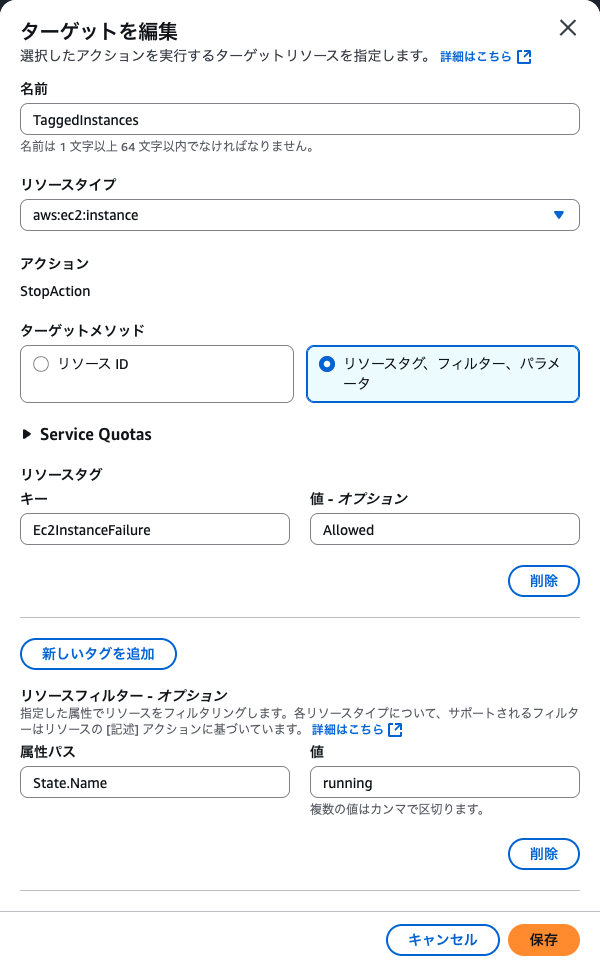
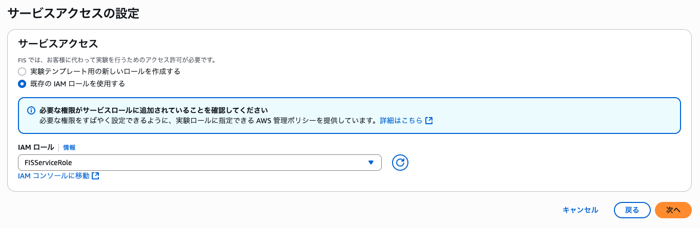
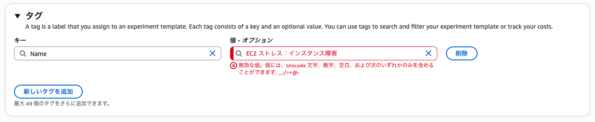

# 障害は忘れた頃にやってくる「AWS Fault Injection Service」で障害を食らってみよう / AWS FIS の設定と実験2

JAWS-UG 神戸 #7 で実施予定の AWS Fault Injection Service ハンズオン用シナリオです。

AWS マネジメントコンソールを操作し、「シナリオライブラリ」から AWS で事前に用意されているテンプレートを使用してみます。

## シナリオライブラリを利用した実験テンプレート作成

### 実験テンプレートを作成する

1. AWS マネジメントコンソールで [AWS FIS](https://ap-northeast-1.console.aws.amazon.com/resiliencehub/home?region=ap-northeast-1#/) へ遷移し、左サイドナビから「[シナリオライブラリ](https://ap-northeast-1.console.aws.amazon.com/fis/home?region=ap-northeast-1#ScenarioLibrary)」をクリックします
2. 一覧から「EC2 ストレス：インスタンス障害」を選択し、ページ上部の「シナリオ使用してテンプレートを作成」ボタンをクリックします  
3. ステップ 1 「テンプレートの詳細を指定」ページでは内容を変更せず「次へ」をクリックします  
4. ステップ 2 「アクションとターゲットを指定」ページでターゲットとして表示される「TaggedInstances」確認します
    - 三点リーダを縦にしたようなマークをクリックして表示される「編集」リンクをクリックするか、TaggedInstances としてカード状に表示されている中の「aws:ec2:instance」リンクをクリックします
5. リソースタグとして「キー」に `Ec2InstanceFailure` 、「値-オプション」に `Allowed` が設定されていることを確認します   
     事前準備の CloudFormation テンプレートをそのまま利用していれば該当のタグがすでにインスタンスに設定済ですが、変更していた場合は適宜実環境に合わせます  
     （変更が必要ない場合は「キャンセル」ボタンでダイアログを閉じて OK）
6. 次画面の「サービスアクセスの設定」では「既存の IAM ロールを使用する」を選択し、「FISServiceRole」ロールを選択し次へ進みます  
7. オプション設定画面は必要に応じて設定を調整し、「次へ」ボタンをクリックし、「確認して作成」ページでレビューをした上で「実験テンプレートを作成」ボタンをクリックします

> [!CAUTION]
> 2025年6月15日現在、コンソールの言語設定が日本語となっている状態で該当のシナリオを使用して進めた場合「テンプレートの詳細を指定」の「名前 - オプション」にデフォルトで挿入されている文字列がオプション設定の「タグ」の値に流用されるものと見られます。
> この時流用される値が「タグとしては使えない文字」を含んでいるようで修正しないとエラーが発生する状況です  

## 実験の実施（1回目）

1. AWS マネジメントコンソールで  [AWS FIS](https://ap-northeast-1.console.aws.amazon.com/fis/home?region=ap-northeast-1#Home) → [実験テンプレート](https://ap-northeast-1.console.aws.amazon.com/fis/home?region=ap-northeast-1#ExperimentTemplates) ページへ遷移します
2. 「1 つ以上のインスタンスを 5 分間停止します (インスタンスタグに基づいてターゲットを設定します)。」として作成されているテンプレートにチェックを入れ「実験を開始」ボタンをクリックします
3. 「実験を開始EXTxxxxxxxx」のページへ遷移したら「実験を開始」ボタンをクリックします

### 挙動の確認（想定）

1. WordPress で構築された Web サイトへアクセスしても応答が返ってこない状況が続く（シナリオライブラリをそのまま利用している場合であれば 5 分間、EC2 インスタンスが停止している状態が継続する）
2. 5 分間の実験実行が完了した後も、アクセスが正常に行えない状況が続く
    1. 想定ではトップページは閲覧可能であると考えられるが、サンプルページなどへアクセスした際に応答が返ってこないなどが発生することが想定される
      1. これは CloudFormation スタックで作成している EC2 がパブリックサブネットに配置されている、かつ、「パブリック IP の自動割り当て」設定で割り当てられたパブリック IP がインスタンスの停止によって変更されたことに起因します
      2. その上で WordPress のインストール時にサイト URL が以前の IP アドレスのまま config ファイルに書かれていることでサイト URL が合致しなくなったことが原因で発生します

### 一時復旧

上記、＜2＞ のパブリック IP アドレスが変更されてしまうことで正しく閲覧できない状況を修復します。

#### EC2 インスタンスへの接続

AWS マネジメントコンソールから CloudShell を起動し、以下のコマンドを実行します

```bash
PUBLIC_IP=$(aws ec2 describe-instances   --filters "Name=instance-state-name,Values=running"   --query 'Reservations[].Instances[?contains(Tags[?Key==`Name`].Value | [0], `-EC2-Instance`)][].NetworkInterfaces[].Association.PublicIp' --output text)
ssh -i key.pem ec2-user@"${PUBLIC_IP}"
# この後 Are you sure you want to continue connecting (yes/no/[fingerprint])? と聞かれるはずなので yes で進める
```

#### WordPress 設定の変更

```bash
cd /var/www/html/
GLOBAL_IP=$(curl inet-ip.info)
wp option update home "http://${GLOBAL_IP}"
wp option update siteurl "http://${GLOBAL_IP}"
```

この後、CloudShell では SSH 接続を終わらせておく。

インスタンス停止後に再開したため変更されているグローバル IP アドレスへ Web ブラウザでアクセスし、WordPress サイトが正しく表示できることを確認する。

## 実験の実施（2回目）

### 構成の変更

現在の構成では Web サーバが単一障害点であり、かつ、自動割り当てのパブリック IP アドレスに依存している問題点がある。  
そのため構成を変更します。

```bash
wget https://raw.githubusercontent.com/kazzpapa3/jawsug-kobe/refs/heads/main/aws-fis/changeset-02.yaml
aws cloudformation create-change-set --change-set-name multi-az-webserver-with-alb --stack-name init --template-body file://changeset-02.yaml --capabilities CAPABILITY_IAM
CHANGESET_ARN_FOR_MULTI_WEB_SERVER_WITH_ALB=$(aws cloudformation list-change-sets --stack-name init --query "Summaries[?contains(ChangeSetName,'multi-az-webserver-with-alb')].ChangeSetId" --output text)
aws cloudformation wait change-set-create-complete --change-set-name ${CHANGESET_ARN_FOR_MULTI_WEB_SERVER_WITH_ALB}
aws cloudformation execute-change-set --change-set-name ${CHANGESET_ARN_FOR_MULTI_WEB_SERVER_WITH_ALB}
```

<details><summary>マネジメントコンソールで実施する場合は以下となります。</summary>

1. [changeset-02.yaml](https://raw.githubusercontent.com/kazzpapa3/jawsug-kobe/refs/heads/main/aws-fis/changeset-02.yaml) をダウンロードします
2. CloudFormation スタックを選択し「スタックの更新」プルダウンから「変更セットを作成」をクリックします
3. 「前提条件 - テンプレートの準備」を「既存のテンプレートを置換」とし、「テンプレートの指定」を「テンプレートファイルのアップロード」とした上で ＜1＞ でダウンロードした CloudFormation テンプレートをアップロードし、「次へ」ボタンをクリックします
4. 遷移した「変更セットの詳細を指定」ページは変更せず、ページ下部の「次へ」ボタンをクリックします
5. 「変更セットオプションを設定 - オプション」ページ下部の「AWS CloudFormation によって IAM リソースが作成される場合があることを承認します。」にチェックを入れ「次へ」をクリックし、次画面で「送信」ボタンをクリックします
6. 「変更セット」の詳細画面に遷移したのち、「変更セットを実行」ボタンが活性化するまでを待機します。（待機時間は約 2 分）
7. そのまま「変更セットを実行」ボタンをクリックし、表示されるダイアログも変更せずそのまま「変更セットを実行」ボタンをクリックします（このあと 5 分ほど時間を要します）
8. スタックのステータスが「UPDATE_COMPLETE」となったことを確認し、「出力」タブから `ALBDNSName` の値を控えておきます

</details>

### 変更後の確認

前工程 ＜8＞ で控えた `ALBDNSName` に対してウェブブラウザからアクセスし、正しく WordPress サイトを閲覧できることを確認します。

### 実験の操作

1. AWS マネジメントコンソールで  [AWS FIS](https://ap-northeast-1.console.aws.amazon.com/fis/home?region=ap-northeast-1#Home) → [実験テンプレート](https://ap-northeast-1.console.aws.amazon.com/fis/home?region=ap-northeast-1#ExperimentTemplates) ページへ遷移します
2. 「1 つ以上のインスタンスを 5 分間停止します (インスタンスタグに基づいてターゲットを設定します)。」として作成されているテンプレートにチェックを入れ「実験を開始」ボタンをクリックします
3. 「実験を開始EXTxxxxxxxx」のページへ遷移したら「実験を開始」ボタンをクリックします


### 挙動の確認（想定）

1. 実験テンプレート実行中に、EC2 インスタンス（この手順通り実施している場合 `init-WebServer` という Name タグを持っているはず）で実行中のステータスのインスタンスが１台になっていることを確認する
2. 台数が減っている場合でも WordPress で構築された Web サイトへアクセスし、問題なくサイトが閲覧できることを確認する

---

[あとかたづけ](./scenario-04.md) へ

