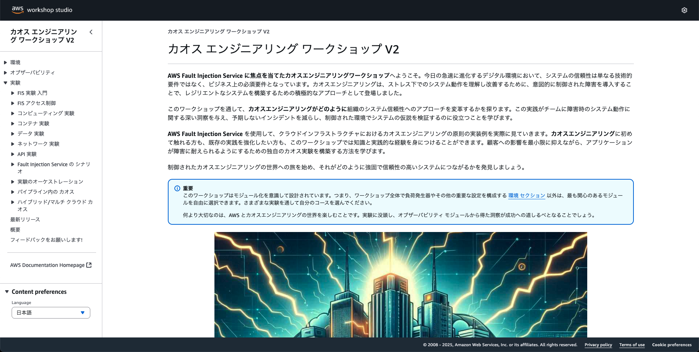

# 障害は忘れた頃にやってくる「AWS Fault Injection Service」で障害を食らってみよう / あとかたづけ

JAWS-UG 神戸 #7 で実施予定の AWS Fault Injection Service ハンズオン用シナリオです。

ハンズオンで作成したリソースを削除し、従量課金が発生しないようにします。

## CloudFormation スタックの削除（削除まで 15 分ほどかかります）

CloudShell を起動し以下の通りコマンドを実行する

```bash
aws cloudformation delete-stack --stack-name init
```

<details><summary>マネジメントコンソールで実施する場合は以下となります。</summary>

1. [CloudFormation](https://ap-northeast-1.console.aws.amazon.com/cloudformation/home?region=ap-northeast-1#/stacks?filteringText=&filteringStatus=active&viewNested=true)ページへ遷移し、スタック一覧から対象のスタックのラジオボタンにチェックを入れる
2. ページ上部の「削除」ボタンをクリックする
3. ポップアップするダイアログを確認し、「削除」ボタンをクリックする

</details>

## AMI、スナップショットの削除

```bash
AMI_ID=$(aws ec2 describe-images --filters "Name=name,Values=*WordPress-AMI" --query 'Images[].ImageId' --output text)
SNAPSHOT_IDS=$(aws ec2 describe-images --image-ids ${AMI_ID} --query 'Images[0].BlockDeviceMappings[*].Ebs.SnapshotId' --output text)
aws ec2 deregister-image --image-id $AMI_ID
for SNAPSHOT_ID in ${SNAPSHOT_IDS}; do
    aws ec2 delete-snapshot --snapshot-id ${SNAPSHOT_ID}
done
```
<details><summary>マネジメントコンソールで実施する場合は以下となります。</summary>

CloudShell を起動し以下の通りコマンドを実行する

1. [EC2](https://ap-northeast-1.console.aws.amazon.com/ec2/home?region=ap-northeast-1#Images:visibility=owned-by-me)ページから AMI ページへ遷移し、Amazon マシンイメージ (AMI)一覧から対象のイメージ（手順通り進めていれば init-WordPress-AMI ）にチェックを入れる
2. ページ上部の「アクション」プルダウンから「AMI を登録解除」を選択する
3. ポップアップ画面で「関連付けられたスナップショットの削除」にチェックを入れ「AMI を登録解除」ボタンをクリックします

</details>

## AWS FIS 実験テンプレートの削除

CloudShell を起動し以下の通りコマンドを実行する

```bash
EXPERIMENT_TEMPLATES=$(aws fis list-experiment-templates --query "experimentTemplates[?contains(description, 'Reboot RDS') || contains(description, '1 つ以上のインスタンスを')].id" --output text)

for EXPERIMENT_TEMPLATE in $(echo "${EXPERIMENT_TEMPLATES}"); do
  aws fis delete-experiment-template --id "${EXPERIMENT_TEMPLATE}"
done
```

<details><summary>マネジメントコンソールで実施する場合は以下となります。</summary>

1. [AWS FIS](https://ap-northeast-1.console.aws.amazon.com/fis/home?region=ap-northeast-1#ExperimentTemplates)ページから「実験テンプレート」ページへ遷移し、説明欄に `Reboot RDS` および `1 つ以上のインスタンスを 5 分間停止します (インスタンスタグに基づいてターゲットを設定します)。` を持つ実験テンプレートにチェックを入れる
2. ページ上部の「アクション」プルダウンから「実験テンプレートを削除」を選択する
3. ポップアップ画面で確認のための文字列を入力し「実験テンプレートを削除」ボタンをクリックします

</details>

## IAM ロールの削除

CloudShell を起動し以下の通りコマンドを実行する

```bash


```

<details><summary>マネジメントコンソールで実施する場合は以下となります。</summary>

1. [IAM](https://us-east-1.console.aws.amazon.com/iam/home?region=ap-northeast-1#/roles) ページから「ロール」ページへ遷移し、`FISServiceRole` を検索する
2. 目的のロールにチェックを入れ、ページ上部の「削除」ボタンをクリックを選択する
3. ポップアップ画面で確認のための文字列を入力し「削除」ボタンをクリックします

</details>

---

## おまけ

今回の JAWS-UG 神戸の [【JAWS-UG 神戸 #7】リブートからほぼ１周年！ハンズオン大会](https://jawsug-kobe.connpass.com/event/359389/) では、当初 AWS 日本語ハンズオン集の [JP Contents Hub](https://aws-samples.github.io/jp-contents-hub/) にある [カオスエンジニアリングワークショップ ※現在遷移先のコンテンツも削除されました](https://catalog.us-east-1.prod.workshops.aws/workshops/1193c2c1-493f-4ec8-a493-14b913b4f7c1/ja-JP) の利用を考えていました。

残念ながら JP Contents Hub にあるものはシナリオ中で呼ばれる CloudFormation スタックの問題で動作しない状況であることが判明しました。
そこで、最新版である V2 の [Chaos Engineering with AWS Fault Injection Service (FIS)](https://workshops.aws/card/fault) の利用検討もしたのですが、若干ボリュームが多く、中〜上級者向けの内容であったので、一歩手前の入門編的なハンズオンシナリオを作成した次第です。

今回のハンズオンで概要を掴んでいただいて、より実践的なシナリオへの挑戦をいただけると良いかと思いました。（神戸でもまたハンズオンをやってみたいですね。障害は忘れた頃にやってくるので、今回のハンズオンを忘れた頃にでも…）

<a href="https://workshops.aws/card/fault"></a>
