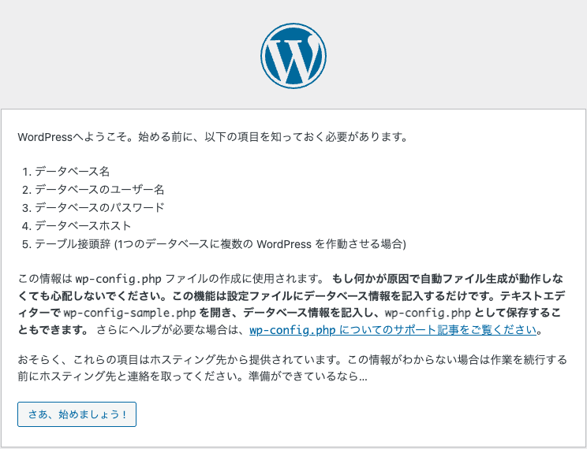
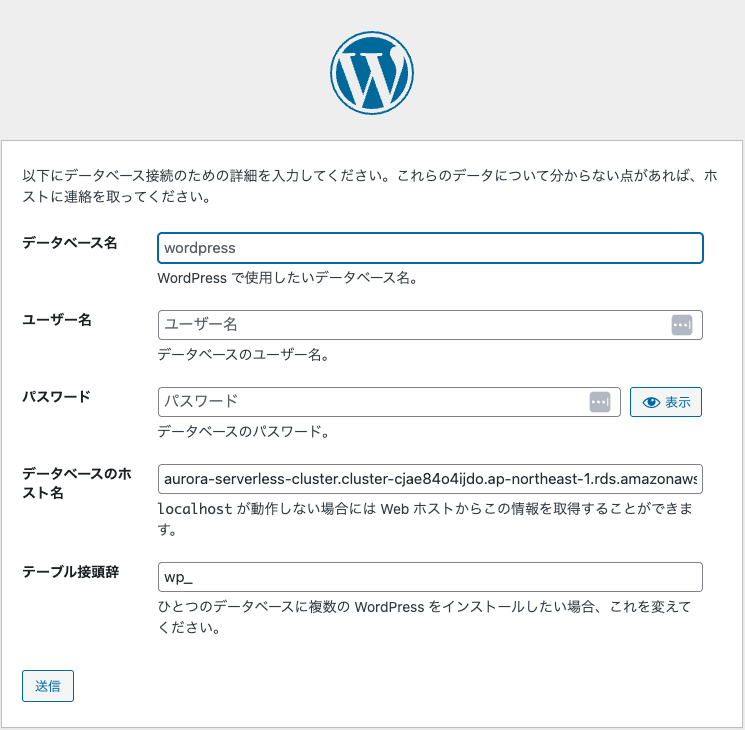
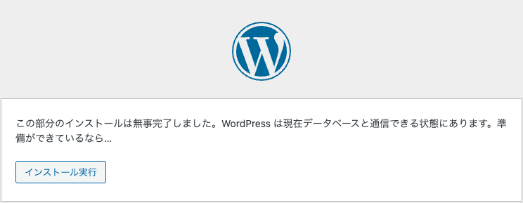
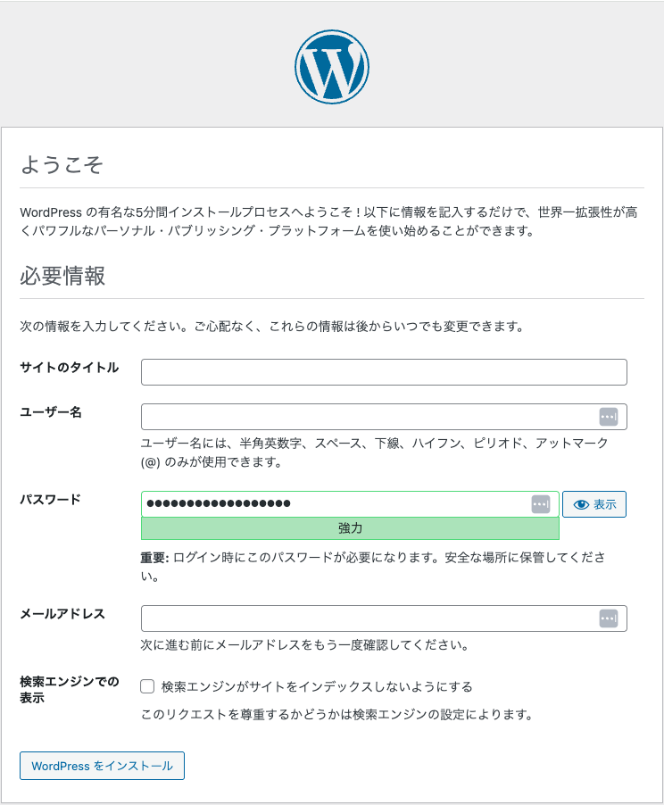
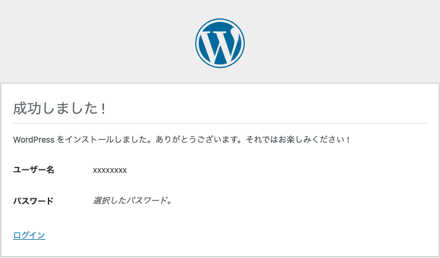

# 障害は忘れた頃にやってくる「AWS Fault Injection Service」で障害を食らってみよう

JAWS-UG 神戸 #7 で実施予定の AWS Fault Injection Service ハンズオン用シナリオです。

## 前提

- 可能な限り発行したばかりの AWS アカウントの利用が望ましいです
  - VPC を一つ作成しますので、既存環境がある場合 Quotas に引っかかる可能性があります
- 東京リージョンでの実行を想定しています
- AWS CLI での操作は CloudShell で実施することを想定しています
- 2025年6月15日現在の AWS API 仕様に基づいて構築していますので、将来の AWS の変更によって挙動が変わる可能性があります

## 事前準備

### 事前準備1：CloudFormation テンプレートの実行

AWS FIS によって引き起こされる事象を喰らう環境として、粗末なウェブサーバを１台だけ持つインフラ環境を構築します。

環境が構築されるまで 15 分程度時間を要します。

#### マネジメントコンソールでの操作

1. [vpc-ec2-aurora-serverless-template-updated.yaml](./vpc-ec2-aurora-serverless-template-updated.yaml) をダウンロードしておきます
2. AWS マネジメントコンソールより CloudFormation へ遷移します。  
    なお、東京リージョン（ap-northeast-1）で実行されることを期待するテンプレートとなるため、リージョンが東京リージョン（ap-northeast-1）であることを合わせて確認します
3. 「スタックの作成」から「テンプレートの指定」を「テンプレートファイルのアップロード」とした上で ＜1＞ でダウンロードしたテンプレートをアップロードします
4. スタック名を適宜設定します。  
    なおパラメータの値はデフォルト値のままで良いですが、セキュリティ的に気になる点があれば、ご自身の判断で変更しても構いません。
5. 「次へ」ボタンをクリックします。

> [!WARNING]  
> この際、ブラウザによっては「パスワードを変更してください」などのパスワード マネージャーからの警告が出る可能性があります。  
> これは CloudFormation のパラメータ値として設定している Aurora MySQL の認証情報としてセルフマネージドのマスターパスワードに安直な文字列を使用していることに依存します。

#### AWS CLI での操作

```bash
wget https://raw.githubusercontent.com/kazzpapa3/jawsug-kobe/refs/heads/main/aws-fis/init.yaml
aws cloudformation create-stack \
  --stack-name init \
  --template-body file://init.yaml \
  --capabilities CAPABILITY_IAM
```

### 事前準備2：WordPress の設定

1. CloudFormation の「出力」タブを確認しながら、`EC2PublicIP` の値の IP アドレスに ウェブブラウザでアクセスする
2. 「さあ、始めましょう！」ボタンが表示されていることを確認し、ボタンをクリックする
3. データベース名、ユーザー名、パスワードは CloudFormation テンプレートで定義してあり、デフォルトから変更していなければ以下の通りとなります
    -  データベース名：`mydb`
    - ユーザー名：`admin`
    - パスワード：`Password123!`
4. データベースのホスト名は CloudFormation の「出力」タブにある `AuroraClusterEndpoint` の値を入力します
5. 「テーブル接頭辞」はデフォルトの「wp_」のままとし「送信」ボタンをクリックします
6. 次画面で「この部分のインストールは無事完了しました。WordPress は現在データベースと通信できる状態にあります。準備ができているなら…」と表示されていることを確認し「インストール実行」ボタンをクリックします
7. 「ようこそ」画面で「サイトのタイトル」「ユーザー名」「メールアドレス」を適宜入力し、「パスワード」として表示されているものをコピー（あるいは変更した上でコピー）し「WordPress をインストール」ボタンをクリックします
8. 「成功しました！」画面へ正しく遷移したことを確認します
9. ＜1＞ で確認した `EC2PublicIP` の値の IP アドレスに ウェブブラウザでアクセスすると「Hello world!」という記事だけが表示されている WordPress サイトが表示されることを確認しておきます


## AWS FIS の設定

以降の操作は CloudShell で実行することを想定しています。

### AWS FIS 用の信頼関係ドキュメントの作成

信頼するエンティティとして AWS FIS（fis.amazonaws.com）を持つ信頼関係ドキュメントを作成します。

```bash
cat << EOF > fis-trust-policy.json
{
  "Version": "2012-10-17",
  "Statement": [
    {
      "Effect": "Allow",
      "Principal": {
        "Service": "fis.amazonaws.com"
      },
      "Action": "sts:AssumeRole"
    }
  ]
}
EOF
```

### AWS FIS 用の IAM ロールの作成とポリシーのアタッチ

後述する実験ドキュメントで指定し、実験のためのリソース操作を行う IAM ロールを作成します。

そして実験として EC2 に対する操作、RDS に対する操作を行いたいため、AWS で用意している `AWSFaultInjectionSimulatorEC2Access` ポリシーと `AWSFaultInjectionSimulatorRDSAccess` ポリシーをアタッチします。

```bash
aws iam create-role \
  --role-name FISServiceRole \
  --assume-role-policy-document file://fis-trust-policy.json

aws iam attach-role-policy \
  --role-name FISServiceRole \
  --policy-arn arn:aws:iam::aws:policy/service-role/AWSFaultInjectionSimulatorEC2Access

aws iam attach-role-policy \
  --role-name FISServiceRole \
  --policy-arn arn:aws:iam::aws:policy/service-role/AWSFaultInjectionSimulatorRDSAccess
```

### 実験テンプレートの作成1（RDSに対する操作の実験）

AWS マネジメントコンソールで CloudShell を起動し、以下のコマンドを実行します。

このテンプレートでは、現在稼働している DB インスタンスのアベイラビリティゾーンと同一の AZ 内のリソース全てを対象とした DB インスタンスの再起動を実行します。  

> [!WARNING]  
> コマンド自体は「事前準備1」の CloudFormation テンプレートをそのまま利用されていることを想定し、DB 識別子が「aurora-serverless-cluster-instance」であることを前提として組み立てています。  
> DB 識別子名を変更している場合は適宜読み替えてください。

```bash
DB_INSTANCE_AZ=$(aws rds describe-db-instances --query "DBInstances[?DBInstanceIdentifier=='aurora-serverless-cluster-instance'].AvailabilityZone" --output text)
ROLE_ARN_FOR_FIS=$(aws iam get-role --role-name FISServiceRole --query 'Role.Arn' --output text)
cat << EOF > fis-experiment-template-for-rds.json
{
    "description": "Reboot RDS",
    "targets": {
        "DBInstances-Target-1": {
            "resourceType": "aws:rds:db",
            "selectionMode": "ALL",
            "parameters": {
                "availabilityZoneIdentifiers": "${DB_INSTANCE_AZ}"
            }
        }
    },
    "actions": {
        "RDS": {
            "actionId": "aws:rds:reboot-db-instances",
            "parameters": {
                "forceFailover": "false"
            },
            "targets": {
                "DBInstances": "DBInstances-Target-1"
            }
        }
    },
    "stopConditions": [
        {
            "source": "none"
        }
    ],
    "roleArn": "arn:aws:iam::720791945764:role/FISServiceRole",
    "tags": {},
    "experimentOptions": {
        "accountTargeting": "single-account",
        "emptyTargetResolutionMode": "fail"
    }
}
EOF

aws fis create-experiment-template \
    --cli-input-json file://fis-experiment-template-for-rds.json
```

#### 補足


<details><summary>マネジメントコンソールで実施する場合は以下となります。</summary>

あとでかく

</details>


### 実験の実施


### 実験

### 実験テンプレートを作成する

```bash
ROLE_ARN_FOR_FIS=$(aws iam get-role --role-name FISServiceRole --query 'Role.Arn' --output text)
cat << EOF > fis-experiment-template.json
{
        "description": "1 つ以上のインスタンスを 2 分間停止します",
        "targets": {
                "TaggedInstances": {
                        "resourceType": "aws:ec2:instance",
                        "resourceTags": {
                                "Name": "fis-EC2-Instance"
                        },
                        "filters": [
                                {
                                        "path": "State.Name",
                                        "values": [
                                                "running"
                                        ]
                                }
                        ],
                        "selectionMode": "COUNT(1)"
                }
        },
        "actions": {
                "StopAction": {
                        "actionId": "aws:ec2:stop-instances",
                        "description": "特定のタグを持つインスタンスを対象にする",
                        "parameters": {
                                "startInstancesAfterDuration": "PT2M"
                        },
                        "targets": {
                                "Instances": "TaggedInstances"
                        }
                }
        },
        "stopConditions": [
                {
                        "source": "none"
                }
        ],
        "roleArn": "${ROLE_ARN_FOR_FIS}",
        "tags": {},
        "experimentOptions": {
                "accountTargeting": "single-account",
                "emptyTargetResolutionMode": "fail"
        }
}
EOF

aws fis create-experiment-template \
    --cli-input-json file://fis-experiment-template.json
```

## 環境の作り替え


### EC2 インスタンスへの接続

AWS マネジメントコンソールから CloudShell を起動し、以下のコマンドを実行します

```bash
KEY_NAME=$(aws ssm describe-parameters --query "Parameters[?contains(Name, 'keypair')].Name" --output text)
aws ssm get-parameters --names "${KEY_NAME}" --with-decryption --query "Parameters[].Value" --output text > key.pem
chmod 400 key.pem
PUBLIC_IP=$(aws ec2 describe-instances   --filters "Name=instance-state-name,Values=running"   --query 'Reservations[].Instances[?contains(Tags[?Key==`Name`].Value | [0], `-EC2-Instance`)][].NetworkInterfaces[].Association.PublicIp' --output text)
ssh -i key.pem ec2-user@"${PUBLIC_IP}cd /var/www/html/"
```

### WordPres 設定の変更

```bash
cd /var/www/html/
GLOBAL_IP=$(curl inet-ip.info)
wp option update home "http://${GLOBAL_IP}"
wp option update siteurl "http://${GLOBAL_IP}"
```


9vE!yiPF#adjA@fi%1


### CloudWatch ダッシュボードの作成

```bash
aws cloudwatch put-dashboard \
    --dashboard-name FIS \
    --dashboard-body '{"widgets":[{"height":6,"width":6,"y":0,"x":0,"type":"metric","properties":{"view":"timeSeries","stacked":false,"metrics":[["Namespace","CPUUtilization","Environment","Prod","Type","App"]],"region":"ap-notheast-1"}}]}'
```


aws iam attach-role-policy \
  --role-name FISServiceRole \
  --policy-arn arn:aws:iam::aws:policy/AmazonS3FullAccess

aws iam attach-role-policy \
  --role-name FISServiceRole \
  --policy-arn arn:aws:iam::aws:policy/CloudWatchFullAccessV2
